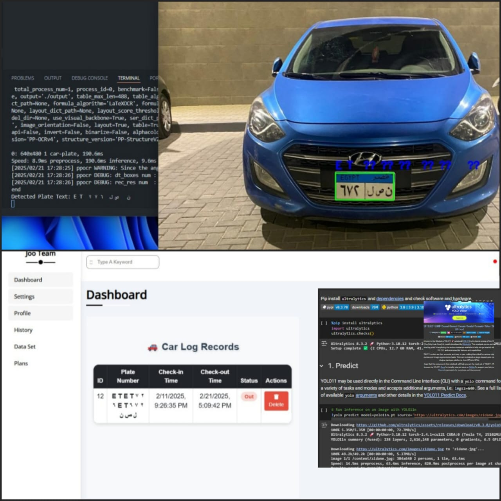

# ANPR System for Vehicle Check-in and Check-out (v2 Update)



## 🚀 What's New in v2?

The **v2 update** of the **Automated Number Plate Recognition (ANPR) System** brings major improvements in **accuracy, performance, and system architecture**.

### 🔄 Key Differences Between v1 and v2

| Feature | **v1** | **v2** |
|---------|--------|--------|
| **License Plate Detection** | YOLOv4 | **Upgraded to YOLOv11** |
| **OCR (Text Extraction)** | Default PaddleOCR | **Optimized with OpenCV Pre-processing** |
| **Database Schema** | Basic user tracking | **Indexes, constraints & duration calculation** |
| **Vehicle Entry/Exit Logic** | Manual input handling | **Automated duplicate entry prevention** |
| **Web Application** | Basic frontend | **Real-time tracking with Express.js** |
| **Error Handling** | Limited | **Enhanced database error handling & logging** |
| **Environment Management** | Regular Python setup | **Anaconda virtual environment for better package management** |
| **Security Enhancements** | Basic MySQL setup | **.env file for database credentials protection** |

---

## 📖 Overview

This project implements an **Automated Number Plate Recognition (ANPR)** system to automate **vehicle check-in and check-out** using **deep learning and computer vision**. It captures license plate images, processes them to extract text, and **stores the data** for future reference. A web interface is available to track vehicle history.

---

## 🔥 Features

✅ **YOLOv11 for Improved License Plate Detection**  
✅ **Better OCR Accuracy with PaddleOCR & OpenCV**  
✅ **Optimized MySQL Database (Indexes, Constraints, Auto-calculated Duration)**  
✅ **Automated Vehicle Entry & Exit Management**  
✅ **Secure .env File for Database Credentials**  
✅ **Real-time Web Tracking with Express.js**  

---

## 🛠️ Installation & Setup

### 📌 Prerequisites:
- **Anaconda** – [Download](https://www.anaconda.com/products/distribution)
- **MySQL** – [Download](https://dev.mysql.com/downloads/installer/)
- **Node.js & npm** – [Download](https://nodejs.org/)
- **VS Code** – [Download](https://code.visualstudio.com/)

---

### 🏗️ Step-by-Step Setup

#### 1️⃣ Clone the Repository
```sh
git clone https://github.com/Yousefa7medmaher/ANPR-System.git
cd ANPR-System
